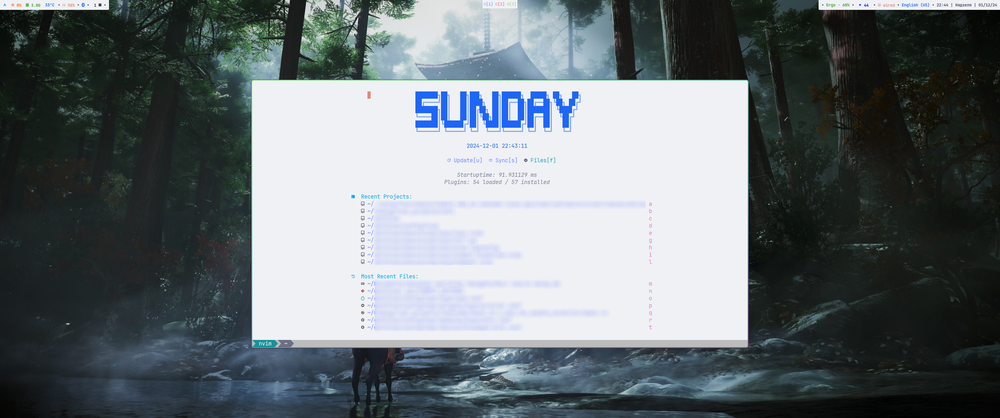

# About


<br>

The dotfiles that I use daily. Here are main things:

- **WM**: Hyprland (and hyprscroller plugin)
- **Wallpaper**: hyprpaper
- **Lock**: hyprlock
- **Idle manager**: hypridle
- **Bar**: waybar
- **Launcher**: wofi
- **Notifications**: noti
- **Screenshot**: grim + satty
- **Terminal**: WezTerm
- **IDE**: NeoVim or JetBrains IntelliJ

> [!NOTE]
> Also dotfiles contains configurations of other small application that I rarely use.
> So you can ignore them, but I store because I wanna see consistency.

## Installation

Before of all further actions need to install some packages.
And there is no installation script that helps you, so you must install them all manually.
It's because I provide only configurations of things that I use and it possible on any
distributions which contains these packages with appropriate versions.
[Here's list of packages that you need to install.](docs/NEEDED_PACKAGES.md)

Also if you see that you have some existing file during installation like `~/.profile` or
`~/.zshrc` then better backup them to avoid breakage.

1. Clone git repository:

```bash
git clone https://github.com/jarkz/dotfiles --recurse-submodules
```

> [!NOTE]
> Make sure that submodules `config/oh-my-zsh` and `config/zsh/themes/ohmyzsh-theme-passion` are pulled correctly.
> Simple check - directories aren't empty.

3. Set some environment variablese in `~/.profile`:

```bash
export XDG_CONFIG_HOME=path/to/dotfiles/config
export XDG_DATA_HOME=path/to/dotfiles/share

# Don't use if you won't use NeoVim.
#
# For debug in C, C++, Rust
# Usually path is /usr/bin/lldb-dap
export LLDB=patn/to/lldb-dap
```

4. Next, create file `~/.zshrc` with single line:

```bash
source path/to/dotfiles/config/zsh/zshrc
```

5. Make symbolic link to enable icon theme:

```bash
ln -s path/to/dotfiles/config/icons ~/.icons
```

## Troubleshooting

If you encountered with some issues after installation then make sure that:

1. You installed all packages that I [listed](docs/NEEDED_PACKAGES.md) and have payed attention to specified versions.
2. You followed each steps and in `~/.profile` and `~/.zshrc` no other lines but mentioned above.

Open an issue, if even with this you have not working environment yet.

## Contribution

You want to make dotfiles better? Add some additional informations in documentations?
Then here are steps to make contribution:

1. Fork the repository and create your branch:

```bash
git branch feature/my-improvment
```

2. Make changes and commit them.
3. Push your changes:

```bash
git push origin feature/my-improvment
```

4. Open a Pull Request.

## License

[MIT](./LICENSE)
